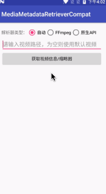
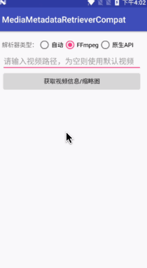
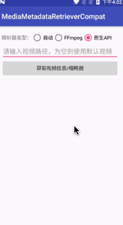

# MediaMetadataRetrieverCompat
多媒体元数据兼容方案 - 支持获取视频缩略图、视频信息  

## __简介__
MediaMetadataRetrieverCompat 内部有两种实现，各有特点  

`FFmpegMediaMetadataRetriever`  
&emsp;&emsp;&emsp;&emsp;&emsp;&emsp;&emsp;基于[FFmpegMediaMetadataRetriever](https://github.com/wseemann/FFmpegMediaMetadataRetriever)，体积大但取帧速度快  

`MediaMetadataRetriever`   
&emsp;&emsp;&emsp;&emsp;&emsp;&emsp;&emsp;基于原生API，不会增加apk体积但取帧慢


## __示例apk__


## __效果演示__




## __快速开始__
```
compile 'com.dyhdyh.compat:media-metadata-retriever-compat:1.0.0'
```

## __初始化（三种模式）__
```
//自动 - 推荐  
MediaMetadataRetrieverCompat mmrc = new MediaMetadataRetrieverCompat();  
//FFmpeg  
//MediaMetadataRetrieverCompat  mmrc = new MediaMetadataRetrieverCompat(MediaMetadataRetrieverCompat.RETRIEVER_FFMPEG);  
//原生API  
//MediaMetadataRetrieverCompat  mmrc = new MediaMetadataRetrieverCompat(MediaMetadataRetrieverCompat.RETRIEVER_ANDROID);
```
## __设置路径__
```
mmrc.setDataSource(path);
```

## __获取Metadata信息__
```
String width = mmrc.extractMetadata(MediaMetadataRetrieverCompat.METADATA_KEY_VIDEO_WIDTH);
String height = mmrc.extractMetadata(MediaMetadataRetrieverCompat.METADATA_KEY_VIDEO_HEIGHT);
String rotation = mmrc.extractMetadata(MediaMetadataRetrieverCompat.METADATA_KEY_VIDEO_ROTATION);
String numTracks = mmrc.extractMetadata(MediaMetadataRetrieverCompat.METADATA_KEY_NUM_TRACKS);
String title = mmrc.extractMetadata(MediaMetadataRetrieverCompat.METADATA_KEY_TITLE);
String album = mmrc.extractMetadata(MediaMetadataRetrieverCompat.METADATA_KEY_ALBUM);
String albumArtist = mmrc.extractMetadata(MediaMetadataRetrieverCompat.METADATA_KEY_ALBUMARTIST);
String author = mmrc.extractMetadata(MediaMetadataRetrieverCompat.METADATA_KEY_AUTHOR);
String duration = mmrc.extractMetadata(MediaMetadataRetrieverCompat.METADATA_KEY_DURATION);
String framerate = mmrc.extractMetadata(MediaMetadataRetrieverCompat.METADATA_KEY_CAPTURE_FRAMERATE);
...
```

## __获取缩略图__
```
//获取第一帧原尺寸图片
mmrc.getFrameAtTime();

//获取指定位置的原尺寸图片 注意这里传的timeUs是微秒
mmrc.getFrameAtTime(timeUs, option);

//获取指定位置指定宽高的缩略图
mmrc.getScaledFrameAtTime(timeUs, MediaMetadataRetrieverCompat.OPTION_CLOSEST, width, height);

//获取指定位置指定宽高并且旋转的缩略图
mmrc.getScaledFrameAtTime(timeUs, MediaMetadataRetrieverCompat.OPTION_CLOSEST, width, height, rotate);
```


###### Android交流群：[146262062](https://jq.qq.com/?_wv=1027&k=47XqOHO)