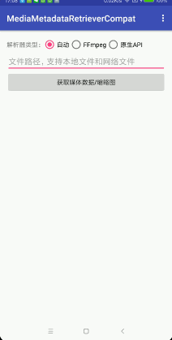

# MediaMetadataRetrieverCompat
多媒体元数据兼容方案 - 支持获取图片、视频、音频文件的媒体信息、视频缩略图  

## __简介__
MediaMetadataRetrieverCompat 内部有两种实现(根据自身需求选择初始化方式)  

`FFmpegMediaMetadataRetriever`  
&emsp;&emsp;&emsp;&emsp;&emsp;&emsp;&emsp;基于[FFmpegMediaMetadataRetriever](https://github.com/wseemann/FFmpegMediaMetadataRetriever)，对视频资源有增强，但库体积较大  

`MediaMetadataRetriever`   
&emsp;&emsp;&emsp;&emsp;&emsp;&emsp;&emsp;基于原生API


## __示例apk__


## __效果演示__


## __快速开始__
```
//核心库 必选
implementation 'com.dyhdyh.compat.mmrc:media-metadata-retriever-compat:1.0.8'

//当需要FFmpegMediaMetadataRetriever时必选
implementation 'com.dyhdyh.remake:FFmpegMediaMetadataRetriever-java:1.0.14'
implementation 'com.dyhdyh.remake:FFmpegMediaMetadataRetriever-armeabi-v7a:1.0.14'

//可选平台
implementation 'com.dyhdyh.remake:FFmpegMediaMetadataRetriever-armeabi:1.0.14'
implementation 'com.dyhdyh.remake:FFmpegMediaMetadataRetriever-arm64-v8a:1.0.14'
implementation 'com.dyhdyh.remake:FFmpegMediaMetadataRetriever-mips:1.0.14'
implementation 'com.dyhdyh.remake:FFmpegMediaMetadataRetriever-x86:1.0.14'
implementation 'com.dyhdyh.remake:FFmpegMediaMetadataRetriever-x86_64:1.0.14'
```

## __初始化（三种模式）__
```
//自动 - 推荐  
MediaMetadataRetrieverCompat mmrc = MediaMetadataRetrieverCompat.create();  
//FFmpeg  
//MediaMetadataRetrieverCompat  mmrc = MediaMetadataRetrieverCompat.create(MediaMetadataRetrieverCompat.RETRIEVER_FFMPEG);  
//原生API  
//MediaMetadataRetrieverCompat  mmrc = MediaMetadataRetrieverCompat.create(MediaMetadataRetrieverCompat.RETRIEVER_ANDROID);
```
## __设置输入源__
```
//本地文件
mmrc.setDataSource(inputFile);

//网络资源(需要放在子线程，每次调用都会下载视频，请慎用，建议自行下载后设置File)
mmrc.setDataSource(url, headers);

//Uri
mmrc.setDataSource(context, uri);
```

## __获取Metadata信息__
```
String width = mmrc.extractMetadata(MediaMetadataRetrieverCompat.METADATA_KEY_VIDEO_WIDTH);
String height = mmrc.extractMetadata(MediaMetadataRetrieverCompat.METADATA_KEY_VIDEO_HEIGHT);
String rotation = mmrc.extractMetadata(MediaMetadataRetrieverCompat.METADATA_KEY_VIDEO_ROTATION);
String numTracks = mmrc.extractMetadata(MediaMetadataRetrieverCompat.METADATA_KEY_NUM_TRACKS);
String title = mmrc.extractMetadata(MediaMetadataRetrieverCompat.METADATA_KEY_TITLE);
String album = mmrc.extractMetadata(MediaMetadataRetrieverCompat.METADATA_KEY_ALBUM);
String albumArtist = mmrc.extractMetadata(MediaMetadataRetrieverCompat.METADATA_KEY_ALBUMARTIST);
String author = mmrc.extractMetadata(MediaMetadataRetrieverCompat.METADATA_KEY_AUTHOR);
String duration = mmrc.extractMetadata(MediaMetadataRetrieverCompat.METADATA_KEY_DURATION);
String framerate = mmrc.extractMetadata(MediaMetadataRetrieverCompat.METADATA_KEY_CAPTURE_FRAMERATE);
...
```

## __获取缩略图__
耗时操作，请放在子线程，获取到的缩略图会根据资源信息自动旋转  

```
//获取第一帧原尺寸图片
mmrc.getFrameAtTime();

//获取指定位置的原尺寸图片 注意这里传的timeUs是微秒
mmrc.getFrameAtTime(timeUs, option);

//获取指定位置指定宽高的缩略图
mmrc.getScaledFrameAtTime(timeUs, MediaMetadataRetrieverCompat.OPTION_CLOSEST, width, height);
```
