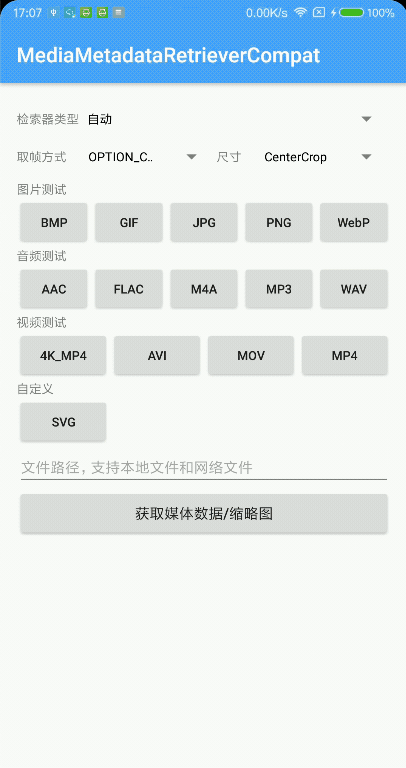
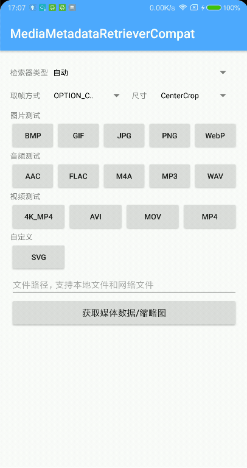
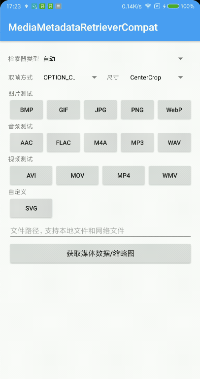
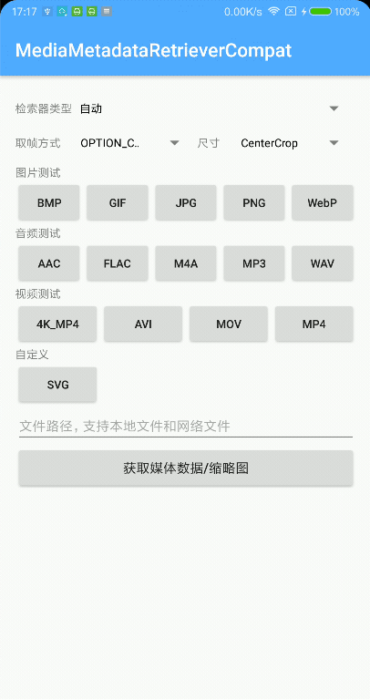

## 效果
　　　　　图片　　　　　　　　　音频　　　　　　　　　　视频　　　　　　　　　自定义

   

示例APK：[example-debug.apk](https://github.com/dengyuhan/MediaMetadataRetrieverCompat/releases/download/1.2.0/example-debug.apk)

## Gradle
```
//必选
implementation 'in.xiandan.mmrc:media-metadata-retriever-compat:1.2.0'

//可选，需要Exif支持时必选
implementation 'com.android.support:exifinterface:28.0.0'
//可选，需要FFmpeg支持时必选，全平台约24M
implementation 'com.github.wseemann:FFmpegMediaMetadataRetriever:1.0.14'

//只保留v7a，可降低至3M
ndk {
    abiFilters 'armeabi-v7a'
}
```

## 数据源类型
[datasource](media-metadata-retriever-compat/src/main/java/in/xiandan/mmrc/datasource) 中预设了一些`DataSource`，以提供不同的输入源，如果需要**自定义数据源**，可`implements DataSource`或参考其它数据源

* [FileSource](media-metadata-retriever-compat/src/main/java/in/xiandan/mmrc/datasource/FileSource.java)
* [HTTPSource](media-metadata-retriever-compat/src/main/java/in/xiandan/mmrc/datasource/HTTPSource.java)
* [UriSource](media-metadata-retriever-compat/src/main/java/in/xiandan/mmrc/datasource/UriSource.java)
* [FileDescriptorSource](media-metadata-retriever-compat/src/main/java/in/xiandan/mmrc/datasource/FileDescriptorSource.java)
* [OkHttpSource](media-metadata-retriever-compat/src/main/java/in/xiandan/mmrc/datasource/OkHttpSource.java)（图片会使用OkHttp）
* [InputStreamSource](media-metadata-retriever-compat/src/main/java/in/xiandan/mmrc/datasource/InputStreamSource.java)（仅支持图片）
* [AssetSource](media-metadata-retriever-compat/src/main/java/in/xiandan/mmrc/datasource/AssetSource.java)（仅支持图片）


## 设置数据源
设置数据源的操作建议放在子线程

```
MediaMetadataRetrieverCompat mmrc = new MediaMetadataRetrieverCompat();

//设置数据源
mmrc.setDataSource(source);
//设置数据源或抛出异常
mmrc.setDataSourceOrThrow(source);
//设置数据源或抛出异常 并指定检索器
mmrc.setDataSourceOrThrow(source, AndroidMediaMetadataRetrieverFactory.class);
```

## 获取Metadata信息
```
final String width = mmrc.extractMetadata(MediaMetadataKey.WIDTH);

//将值转换为int
final int width = mmrc.extractMetadataInt(MediaMetadataKey.WIDTH, 0);

//将值转换为float
final float width = mmrc.extractMetadataFloat(MediaMetadataKey.WIDTH, 0f);

//将值转换为long
final long width = mmrc.extractMetadataLong(MediaMetadataKey.WIDTH, 0L);

...
```

## 获取缩略图
取帧是耗时操作，需要放在子线程，视频有4种取帧方式 

```
//最接近timeUs的关键帧 - 仅视频
MediaMetadataKey.OPTION_CLOSEST_SYNC

//最接近timeUs的帧，不一定是关键帧(性能开销较大) - 仅视频
MediaMetadataKey.OPTION_CLOSEST

//早于timeUs的关键帧 - 仅视频
MediaMetadataKey.OPTION_PREVIOUS_SYNC

//晚于timeUs的关键帧 - 仅视频
MediaMetadataKey.OPTION_NEXT_SYNC
```

```
//获取第一帧原尺寸图片
mmrc.getFrameAtTime();

//获取指定毫秒的原尺寸图片 注意这里传的毫秒不再是微秒
mmrc.getFrameAtTime(0, MediaMetadataKey.OPTION_CLOSEST_SYNC);

//获取指定毫秒的缩略图，并基于指定宽高缩放，输出的Bitmap不一定是指定宽高
mmrc.getScaledFrameAtTime(0, MediaMetadataKey.OPTION_CLOSEST_SYNC, 300, 300);

//获取指定毫秒的缩略图，并按指定宽高缩放裁剪，输出的Bitmap一定是指定宽高
mmrc.getCenterCropFrameAtTime(0, MediaMetadataKey.OPTION_CLOSEST_SYNC, 300, 300);
```

## 全局配置
```
//创建一个新的配置构造器
MediaMetadataConfig.newBuilder()
        .setCustomDataSourceCallback(new MediaMetadataConfig.CustomDataSourceCallback() {
            @Override
            public void setCustomDataSource(IMediaMetadataRetriever retriever, DataSource source) {
                //当设置了自定义数据源时 会回调
            }
        })
        //添加格式检查器
        .addFileFormatChecker(new CustomFormatChecker())
        //添加自定义检索器
        .addCustomRetrieverFactory(new SVGMediaMetadataRetrieverFactory())
        .addCustomRetrieverFactory(new CustomMediaMetadataRetrieverFactory())
        .build()
        //应用配置
        .apply();
```

## 自定义检索器
[custom](example/src/main/java/in/xiandan/mmrc/example/custom) 演示了以SVG文件为例如何**自定义检索器**

```
MediaMetadataConfig.newBuilder()
        .addFileFormatChecker(new CustomFormatChecker())
        .addCustomRetrieverFactory(new SVGMediaMetadataRetrieverFactory())
        .build()
        .apply();
```

## 相关资料
[fresco/imageformat](https://github.com/facebook/fresco/tree/master/imagepipeline-base/src/main/java/com/facebook/imageformat)   
[FFmpegMediaMetadataRetriever](https://github.com/wseemann/FFmpegMediaMetadataRetriever)   
[MediaMetadataRetriever](https://developer.android.google.cn/reference/kotlin/android/media/MediaMetadataRetriever)   
[ImageDecoder](https://developer.android.google.cn/reference/android/graphics/ImageDecoder)   
[ExifInterface](https://developer.android.google.cn/reference/android/media/ExifInterface)   


